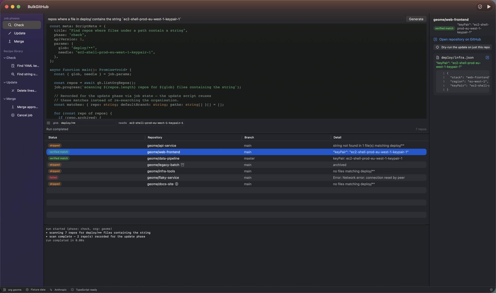
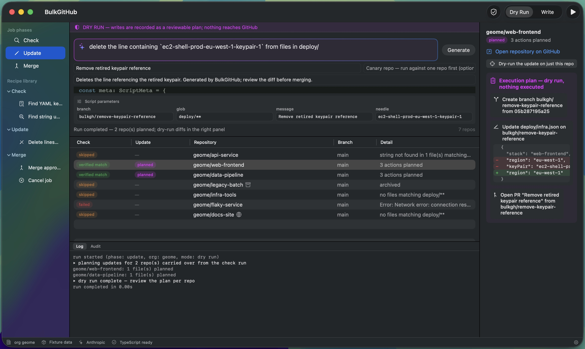

<p align="center">
  
</p>

# BulkGitHub

A native macOS workbench for finding — and later bulk-updating — repositories
across a GitHub organisation. You describe what you want in natural language;
an LLM writes a **TypeScript script** against a small, typed host API; the app
type-checks the script, shows it for review, and executes it in a sandboxed
JavaScriptCore context wired to capability handles (check scripts get a
read-only handle — the write surface does not exist on it).





- Architecture and roadmap: [plans/native-macos-bulkgithub-app-plan-v2.md](plans/native-macos-bulkgithub-app-plan-v2.md)
- Runtime decision record: [decisions/0001-javascriptcore-as-embedded-script-runtime.md](decisions/0001-javascriptcore-as-embedded-script-runtime.md)
- Why merging stays script-driven: [decisions/0002-merge-phase-stays-script-driven.md](decisions/0002-merge-phase-stays-script-driven.md)
- Host API contract: [Sources/BulkGitHubKit/Resources/bulkgh.d.ts](Sources/BulkGitHubKit/Resources/bulkgh.d.ts)

## Build, test, run

Requires Xcode 26+ (Swift 6.2). All engine/model code lives in the SwiftPM
package; `BulkGitHub.xcodeproj` adds the native app shell (run/debug, asset
catalog icon, signing) and consumes the package locally. The project is
generated from [project.yml](project.yml) — edit that, not the pbxproj.

```sh
open BulkGitHub.xcodeproj      # app development (scheme: BulkGitHubApp)
xcodegen generate              # regenerate the project after editing project.yml

swift build                    # CLI build (CI uses this)
swift test                     # engine, validation, golden-recipe, support tests
swift run BulkGitHub           # run the app without Xcode (dev mode, no bundle)

swift Scripts/generate_icon.swift   # regenerate icon (icns + asset catalog) from Assets/icon-source.jpg
./Scripts/make_app.sh               # CLI release build → dist/BulkGitHub.app (ad-hoc signed)
```

The app launches in **fixture mode** with a **mock LLM** — the full
generate → type-check → review → run loop works offline against a canned
7-repo organisation. Flip to live GitHub / Anthropic in Settings (⌘,) once
credentials are stored (Keychain only; scripts can never read them).

## Layout

| Path | What it is |
|---|---|
| `Sources/BulkGitHubKit` | Library: models, GitHub clients (fixture + live), JSC script engine, capability handles, validation pipeline (lint → tsc → transpile → meta), LLM clients, Keychain, persistence |
| `Sources/BulkGitHub` | SwiftUI app: three-pane workbench, script editor, results table, console, Settings |
| `Sources/BulkGitHubKit/Resources` | `bulkgh.d.ts` (the contract), golden recipe, bundled TypeScript compiler + ES libs |
| `Tests/BulkGitHubKitTests` | Host-bridge contract tests, tsc-in-JSC spike tests, golden-recipe end-to-end, persistence |
| `plans/`, `decisions/` | Plan v2 (current), superseded v1, ADR 0001 |

## Phase 1 status (per plan v2)

- [x] SwiftPM scaffold, SwiftUI shell, app icon
- [x] Settings window with Keychain-backed credentials + connection tests
- [x] Core models (jobs, results, evidence, audit events, settings)
- [x] JSC engine: promise bridging, watchdog, cancellation, concurrency limiter
- [x] Read-only capability handle (`gh`/`job`/`parse`); evidence-receipt rule enforced
- [x] `bulkgh.d.ts` v1 (check-phase surface)
- [x] Validation pipeline incl. tsc-in-JSC; golden recipe; fixture GitHub client
- [x] Mock LLM (offline) + Anthropic client (live generation, off by default)
- [x] Persistence and restore-on-launch
- [x] Tests; CI + release workflow skeletons
- [x] Live GitHub/Anthropic exercised end-to-end (check phase verified against
      a real organisation, June 2026; live update dry-runs next)

## Phase 3 status (dry-run updates)

- [x] Update-phase scripts with a **recording write surface**: createBranch /
      putContent / createPR record `PlannedAction`s and return synthesized
      responses — nothing reaches GitHub
- [x] Phase-gated declarations: `bulkgh.update.d.ts` merges the write surface
      in only for update scripts; a check script calling a write fails the
      type-check (and the methods don't exist at runtime either)
- [x] Branch guardrail: only `bulkgh/`-prefixed branch names, enforced in dry-run
- [x] Execution-plan review: per-repo action lists with native before/after
      diffs in the detail pane
- [x] Worked example shipped: `remove_line_with_string` recipe deletes lines
      containing a string, repairing JSON trailing commas when the removed
      key-value pair was last in its object
- [x] Repo selection + write arming (phase 4, with the guarded live handle)

## Phase 4 status (write mode — writes currently hard-disabled)

- [x] Guarded write handle: the same reviewed script re-runs unchanged with
      writes armed, gated in order by repo selection, conformance with the
      reviewed dry-run plan (every write must be exactly the next reviewed
      action), a **drift guard** (the remote file must still match the
      reviewed "before" AND the script must produce the reviewed "after"),
      and idempotency (existing branch/PR halts the repo, no duplicates)
- [x] Arming flow: "Apply…" sheet with per-repo selection (canary
      preselected), explicit target statement, destructive-styled confirm
- [x] Mode is always visible: DRY RUN / ARMED banner over the update
      workspace, ARMED chip in the footer, "Dry Run" toolbar label
- [x] Artifact registry: branches and PRs created by armed runs are recorded
      on the job (with links) — later phases' merge/cancel operate only on
      these
- [x] **Live GitHub writes hard-disabled** (`LiveGitHubClient.liveWritesEnabled`
      is `false`; enabling requires a code change and release): the armed
      workflow runs against fixture data until shaken down end to end
- [ ] Enable live writes once the workflow has been exercised
- [ ] Resume semantics for partially-applied repos (currently: halt safely)

## Phase 5 status (guarded merge and cancel — writes still hard-disabled)

- [x] Registry-scoped merge surface (`bulkgh.merge.d.ts`): `listJobPRs` /
      `mergePR` / `closePR` / `deleteBranch` exist only for merge-phase
      scripts and can only touch branches and PRs THIS job created
- [x] Approval queue: per-PR approval in the merge table captures the head
      SHA; merging requires the approval AND that the head still matches —
      an approval is for a specific state of the branch (host-enforced in
      dry-run too, so drift surfaces at review time)
- [x] Squash merges only, with GitHub's own `sha` precondition on the live
      client; cancel flow closes job PRs and deletes job branches
- [x] Merge scripts dry-run by default like updates: reviewable plan, then
      the same Apply… arming flow; consumed artifacts leave the registry
- [x] Recipes: "Merge approved PRs" and "Cancel job"; full loop rehearsed
      offline — check → update → apply → approve → merge/cancel — against
      the stateful fixture client
- [ ] Live merge writes (same kill switch as phase 4)

## License

Copyright © 2026 Steve Meyfroidt.

BulkGitHub is free software: you can redistribute it and/or modify it under
the terms of the GNU General Public License as published by the Free Software
Foundation, either version 3 of the License, or (at your option) any later
version. It is distributed in the hope that it will be useful, but WITHOUT ANY
WARRANTY; without even the implied warranty of MERCHANTABILITY or FITNESS FOR
A PARTICULAR PURPOSE. See [LICENSE](LICENSE) for the full text.

The bundled TypeScript compiler (`Sources/BulkGitHubKit/Resources/TypeScript/`)
is Copyright Microsoft Corporation, Apache License 2.0. App icon artwork by
Steve Meyfroidt (`Assets/icon-source.jpg`).
