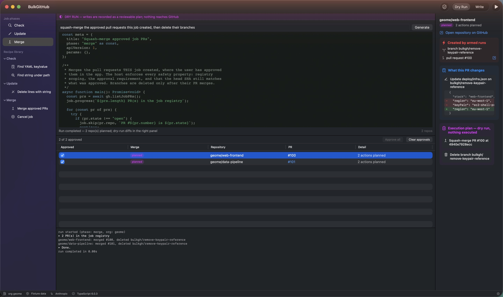

<p align="center">
  
</p>

# BulkGitHub

A native macOS workbench for finding — and bulk-updating — repositories
across a GitHub organisation. You describe what you want in natural language;
an LLM writes a **TypeScript script** against a small, typed host API; the app
type-checks the script, shows it for review, and executes it in a sandboxed
JavaScriptCore context wired to capability handles (check scripts get a
read-only handle — the write surface does not exist on it).

**1 — Check** (read-only): describe what to find, review the generated script,
run it; matches are verified deterministically and shown in situ.


**2 — Update** (dry run by default): the check results carry into the funnel;
the dry run records a reviewable plan with native diffs. The Dry Run | Write
toggle arms real writes only after you've reviewed the plan.


**3 — Merge** (registry-scoped): approve the PRs the job created — each
approval pins the head SHA — then a merge script squash-merges them and
cleans up the branches. It can only touch this job's artifacts.



- Architecture and roadmap: [plans/native-macos-bulkgithub-app-plan-v2.md](plans/native-macos-bulkgithub-app-plan-v2.md)
- Runtime decision record: [decisions/0001-javascriptcore-as-embedded-script-runtime.md](decisions/0001-javascriptcore-as-embedded-script-runtime.md)
- Why merging stays script-driven: [decisions/0002-merge-phase-stays-script-driven.md](decisions/0002-merge-phase-stays-script-driven.md)
- Host API contract: [Sources/BulkGitHubKit/Resources/bulkgh.d.ts](Sources/BulkGitHubKit/Resources/bulkgh.d.ts)

## Build, test, run

Requires Xcode 26+ (Swift 6.2). All engine/model code lives in the SwiftPM
package; `BulkGitHub.xcodeproj` adds the native app shell (run/debug, asset
catalog icon, signing) and consumes the package locally. The project is
generated from [project.yml](project.yml) — edit that, not the pbxproj.

```sh
open BulkGitHub.xcodeproj      # app development (scheme: BulkGitHubApp)
xcodegen generate              # regenerate the project after editing project.yml

swift build                    # CLI build (CI uses this)
swift test                     # engine, validation, golden-recipe, support tests
swift run BulkGitHub           # run the app without Xcode (dev mode, no bundle)

swift Scripts/generate_icon.swift   # regenerate icon (icns + asset catalog) from Assets/icon-source.jpg
./Scripts/make_app.sh               # CLI release build → dist/BulkGitHub.app (ad-hoc signed)
```

The app launches in **fixture mode** with a **mock LLM** — the full
generate → type-check → review → run loop works offline against a canned
7-repo organisation. Flip to live GitHub / Anthropic in Settings (⌘,) once
credentials are stored (Keychain only; scripts can never read them).

## Layout

| Path | What it is |
|---|---|
| `Sources/BulkGitHubKit` | Library: models, GitHub clients (fixture + live), JSC script engine, capability handles, validation pipeline (lint → tsc → transpile → meta), LLM clients, Keychain, persistence |
| `Sources/BulkGitHub` | SwiftUI app: three-pane workbench, script editor, results table, console, Settings |
| `Sources/BulkGitHubKit/Resources` | `bulkgh.d.ts` (the contract), golden recipe, bundled TypeScript compiler + ES libs |
| `Tests/BulkGitHubKitTests` | Host-bridge contract tests, tsc-in-JSC spike tests, golden-recipe end-to-end, persistence |
| `plans/`, `decisions/` | Plan v2 (current), superseded v1, ADR 0001 |

## Safety model

Generated scripts never see the network, the filesystem, or credentials —
only the typed host API, and that surface is phase-gated:

- **Check** scripts get a read-only handle. The write surface does not exist
  on it: a check script calling a write fails the type-check, and the methods
  don't exist at runtime either.
- **Update** scripts run against a **recording write surface** by default:
  createBranch / putContent / createPR record `PlannedAction`s and return
  synthesized responses — nothing reaches GitHub. The plan is reviewed as
  per-repo action lists with native before/after diffs. Arming real writes
  (the Apply… sheet: per-repo selection with the canary preselected, explicit
  target statement, destructive-styled confirm) re-runs the same reviewed
  script gated in order by repo selection, **plan conformance** (every write
  must be exactly the next reviewed action), a **drift guard** (the remote
  file must still match the reviewed "before" AND the script must produce the
  reviewed "after"), idempotency (an existing branch/PR halts the repo, no
  duplicates), and the `bulkgh/` branch-name prefix. A partially-applied repo
  halts safely and is completed by re-running Apply — resume is gated by the
  artifact registry.
- **Merge** scripts are registry-scoped (`bulkgh.merge.d.ts`): `listJobPRs` /
  `mergePR` / `closePR` / `deleteBranch` can only touch branches and PRs THIS
  job created. Merging additionally requires a per-PR approval that pins the
  head SHA — the head must still match at merge time (host-enforced in
  dry-run too, so drift surfaces at review) — and merges are squash-only with
  GitHub's own `sha` precondition. The cancel recipe closes job PRs and
  deletes job branches.

Branches and PRs created by armed runs are recorded on the job as the
**artifact registry** — the boundary of merge/cancel authority. The mode is
always visible (DRY RUN / ARMED banner, ARMED footer chip), and a kill switch
(`LiveGitHubClient.liveWritesEnabled`) turns a build provably inert in one
line; live writes are reachable only through the engine's armed bindings,
behind the Apply sheet's red confirmation.

## License

Copyright © 2026 Steve Meyfroidt.

BulkGitHub is free software: you can redistribute it and/or modify it under
the terms of the GNU General Public License as published by the Free Software
Foundation, either version 3 of the License, or (at your option) any later
version. It is distributed in the hope that it will be useful, but WITHOUT ANY
WARRANTY; without even the implied warranty of MERCHANTABILITY or FITNESS FOR
A PARTICULAR PURPOSE. See [LICENSE](LICENSE) for the full text.

The bundled TypeScript compiler (`Sources/BulkGitHubKit/Resources/TypeScript/`)
is Copyright Microsoft Corporation, Apache License 2.0. App icon artwork by
Steve Meyfroidt (`Assets/icon-source.jpg`).
